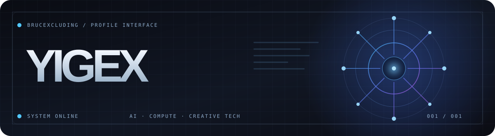
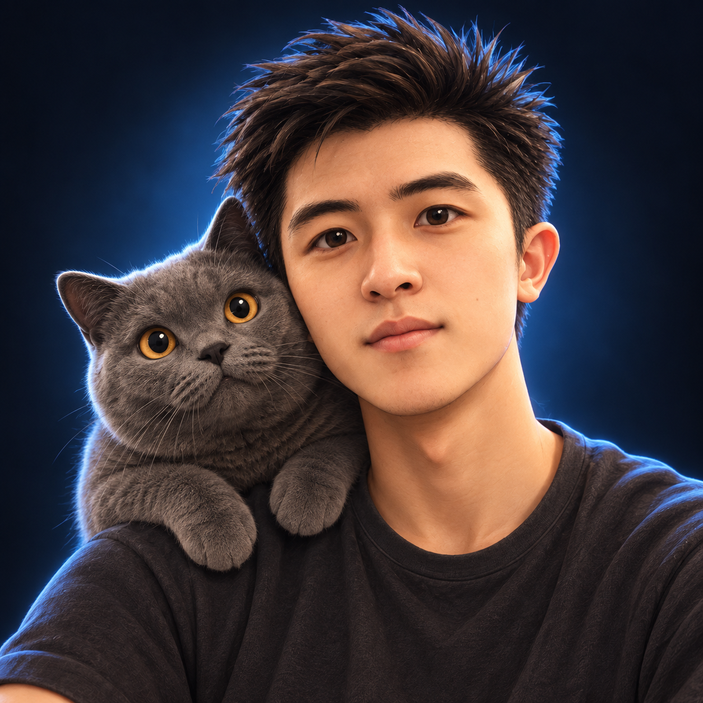

  

<table>
  <tr>
    <td width="230" valign="top">
      
    </td>
    <td valign="top">
      <h2>Hi, I'm Yigex 👋</h2>
      
I explore the space where <strong>AI systems</strong>, <strong>accelerated computing</strong>, and <strong>creative interfaces</strong> meet.

      
I like turning technical ideas into things people can see, use, and build on. Curious by nature, I move between code, visual design, and the systems behind both.

      

        <a href="https://brucexcluding.github.io/"><strong>↗ Enter my portfolio</strong></a>
        &nbsp;·&nbsp;
        <a href="https://github.com/BruceXcluding?tab=repositories">Browse repositories</a>
      

    </td>
  </tr>
</table>

### Current signals

| AI inference | Accelerated compute | Digital experiences |
| :--- | :--- | :--- |
| Exploring how models run in practice | Learning across hardware and software | Making complex ideas feel tangible |

BUILD · TEST · ITERATE · SHARE

